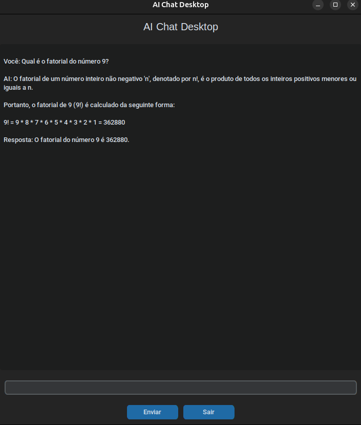

# 🤖 AI Chat Desktop

Uma aplicação desktop de chat com Inteligência Artificial desenvolvida em Python, com interface gráfica moderna e integração com modelos de linguagem via API.

## 📸 Preview



## ✨ Descrição

O **AI Chat Desktop** é um assistente conversacional inspirado em interfaces como o ChatGPT. O projeto foi pensado para oferecer:

- Interface gráfica moderna
- Integração com modelos de linguagem (LLMs)
- Arquitetura modular e escalável
- Experiência de usuário fluida

O sistema permite que o usuário envie mensagens e receba respostas de uma IA em tempo quase real.

## 🧠 Tecnologias Utilizadas

- **Python 3.x**
- **CustomTkinter** — UI moderna
- **Requests** — consumo de API
- **OpenRouter** — API de modelos LLM
- **Threading** — respostas assíncronas

## 🏗️ Estrutura do Projeto

```
ai-chat-desktop/
├── app.py                 # Ponto de entrada da aplicação
├── ui/
│   └── interface.py       # Interface gráfica
├── services/
│   └── ai_service.py      # Integração com API de IA
├── requirements.txt       # Dependências
└── README.md              # Documentação
```

## ⚙️ Funcionalidades

- Interface gráfica estilo chat
- Envio de mensagens pelo teclado ou botão
- Resposta de IA via API
- Atualização dinâmica da conversa
- Estrutura modular (UI + serviços separados)

## 📦 Instalação

1. Clone o repositório:

    ```bash
    git clone https://github.com/seu-usuario/ai-chat-desktop.git
    cd ai-chat-desktop
    ```

2. Instale as dependências:

    ```bash
    pip install -r requirements.txt
    ```

3. Configure a API:

    Crie um arquivo `.env` na raiz do projeto:

    ```env
    API_KEY=sua_chave_aqui
    URL=https://openrouter.ai/api/v1/chat/completions
    ```

## ▶️ Como Executar

```bash
python app.py
```

## 🧪 Exemplo de Uso

- Abra a aplicação
- Digite sua mensagem
- Pressione Enter ou clique em Enviar
- Receba a resposta da IA

## 📌 Arquitetura

O projeto segue uma arquitetura modular:

- **UI Layer** — Interface com o usuário
- **Service Layer** — Comunicação com IA
- **Core App** — Inicialização da aplicação

## 🚀 Próximas Melhorias

- [ ] Streaming de respostas (tipo ChatGPT)
- [ ] Histórico de conversas
- [ ] Bolhas de chat estilo WhatsApp
- [ ] Suporte a múltiplos modelos
- [ ] Empacotamento (.exe)

## 🧠 Aprendizados do Projeto

Este projeto demonstra:

- Consumo de APIs externas
- Arquitetura modular em Python
- Interface gráfica desktop
- Concorrência com threading
- Integração com LLMs